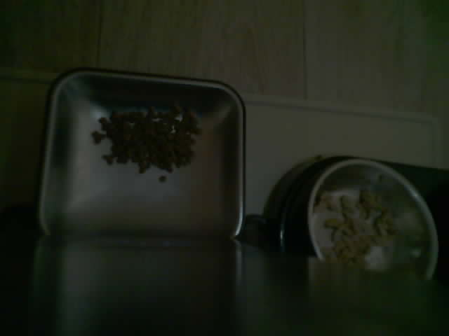

<p align="center">
  
</p>

# Cat Bowl Monitor

[](https://github.com/jr551/ha-cat-bowl-monitor/actions/workflows/validate.yml)
[](https://github.com/jr551/ha-cat-bowl-monitor/releases)
[](LICENSE)

Cat Bowl Monitor is a HACS-compatible Home Assistant custom integration that
uses an OpenAI-compatible vision model to estimate the state of a dry-food bowl
and a separate wet-food bowl. It can check twice daily, compare food consumption
between samples, notify you, and optionally request tightly guarded feeder
actions.

## Real bowl setup

This is an example of the live camera view showing the real dry- and wet-food
bowls monitored by the integration:



## Features

- Independent dry- and wet-bowl status, fill estimate, and empty entities.
- AI estimate of the percentage eaten since the most recent trustworthy
  reference.
- Configurable daily check times, camera light, pet name, bowl layout, and
  confidence threshold.
- Optional repeating checks every 2, 3, 4, 6, 8, 12, or 24 hours, anchored to
  the first daily check time.
- An independent overnight interval can replace the normal slots from 22:00
  until the first daily check; a 2-hour interval adds checks at the same
  anchor-aligned times overnight.
- Direct OpenAI-compatible API settings, or credential reuse from the
  [UBox Camera](https://github.com/jr551/ha-ubox-camera) integration.
- Optional primary and secondary feeder actions using a Home Assistant scene,
  script, or button.
- Optional feeder-active binary sensor and `domain.service` notification action.
- Low-noise notifications by default: routine no-action checks stay silent,
  while feed actions, blocked feeds, and cycle failures are announced. An
  option can restore summaries for every scheduled check.
- One-line Family summaries say whether 1R was dispensed and why. After a feed,
  the integration takes a two-minute image and adds **Cat seen** only when the
  AI confidently sees a cat.
- Any confident cat sighting sends that exact JPEG to Family chat with a short
  caption. A 30-minute duplicate window prevents before/after checks from
  posting the same visit twice.
- Automatic baseline reset after every observed scheduled or manual dispense,
  followed by a post-feed image after the food has settled. This prevents an
  external feeder schedule from making consumption look artificially low.
- Bounded post-feed baseline retries recover from camera startup races and
  malformed provider responses without ever retrying a feeder action.
- Compact structured AI responses are retried with bounded attempts when parsing
  fails, and unverified actuator calls are reported separately from completed
  feeds.
- Bounded latest, before, after, and baseline images instead of an archive.

## Guarded feeding behaviour

A scheduled cycle takes two independent AI samples 30 seconds apart.

- The primary feeder action runs only when both samples confidently show the
  dry bowl empty.
- The secondary feeder action additionally requires both the dry and wet bowls
  to be confidently empty.
- All required actions are validated before either is called.
- The cycle key is saved before an actuator call, so a restart cannot repeat
  that scheduled feed.
- Failed or unverified feeds are never retried automatically.
- After eight continuous hours of inconclusive camera checks, the integration
  may give one 1R safety portion only when no feeder completion occurred during
  that period. This fallback is limited to once per 12 hours, is reported
  clearly, and an unconfirmed action is never retried.
- A genuine `on` to `off` feeder-sensor transition immediately invalidates the
  old consumption comparison. It never actuates a feeder or sends a duplicate
  notification; after two minutes it records a new post-feed baseline.
- A manual **Check now** only takes a sample and can never dispense food.
- Unknown, hidden, dark, or low-confidence bowls fail closed.
- Effectively black frames are rejected before AI analysis. Useful low-light
  frames are normalized for vision, while inconclusive checks stay out of
  Family chat and cannot replace a good comparison baseline.
- ESPHome cameras use their private local snapshot endpoint when available, so
  illumination checks analyze a fresh lit frame instead of HA's cached image.
  The lamp settles for five seconds before capture so the OV2640 exposure has
  time to adjust. Truncated JPEGs receive up to three bounded camera-only
  retries; the feeder action is never retried, and a known direct endpoint does
  not fall back to stale imagery.
- Only the configured primary dry-food zone can drive the primary feeder.
  Secondary wet-food, treat, or temporary-bowl zones are reporting-only when
  no secondary feeder action is configured.
- The secondary zone first distinguishes wet food, treats, other food, empty,
  or unknown. `fresh`, `dried`, and `mixed` apply only to a wet-food batch first
  observed being newly added while moist; otherwise freshness stays `unknown`.
  Home Assistant compares each classified type, appearance, and fill reading with
  the prior stored reading; the vision model cannot infer historical freshness
  from one frame. Secondary classification never influences dry-food feeding.
- **Fresh wet food added** lets a household member explicitly start a known
  moist wet-food batch when visual detection is uncertain; later checks track
  that batch becoming mixed or dried. The button never operates either feeder.

The selected scene, script, or button defines the actual dose. For Tuya
feeders whose individual hoppers are unavailable as native Home Assistant
controls, create Tap-to-Run scenes for the exact doses and select those scenes
in the integration options.

## Installation

1. In HACS, open **Integrations → Custom repositories**.
2. Add `https://github.com/jr551/ha-cat-bowl-monitor` as an **Integration**.
3. Install **Cat Bowl Monitor** and restart Home Assistant.
4. Open **Settings → Devices & services → Add integration** and select
   **Cat Bowl Monitor**.
5. Select the bowl-facing camera and describe where the dry and wet bowls
   appear in its image.

The default schedule is 05:00 and 16:00 in Home Assistant's local timezone.
Both times can be changed in the integration options.

## Vision provider

You can enter an API key, HTTPS base URL, and model for any compatible
Chat Completions vision endpoint. The base URL may be either the API root or
the full `/chat/completions` URL.

Alternatively, leave all three direct-provider fields blank to reuse the
vision provider already configured in UBox Camera. The credential is read from
the loaded config entry in memory and is not copied to Cat Bowl Monitor.

## Entities and events

The integration creates:

- dry and wet status sensors
- dry and wet fill-percentage sensors
- dry and wet empty binary sensors
- a food-eaten sensor
- an auto-feed status sensor
- a safe manual check button
- latest, before-feed, and after-feed sample cameras

It emits these Home Assistant events for advanced automations:

- `cat_bowl_monitor_checked`
- `cat_bowl_monitor_became_empty`
- `cat_bowl_monitor_recovered`
- `cat_bowl_monitor_scheduled_cycle`
- `cat_bowl_monitor_feed_requested`
- `cat_bowl_monitor_baseline_reset`

## Image handling and privacy

Each check sends a resized JPEG to the configured provider. A consumption
comparison sends the previous reference and current image. Home Assistant
retains only `latest.jpg`, `before.jpg`, `after.jpg`, and `baseline.jpg` under
`/config/cat_bowl_monitor/<entry-id>/`; each slot is replaced atomically.

Choose the camera view carefully. Avoid including people, private documents,
screens, or areas outside the feeding station. Review your AI provider's data
handling terms before enabling the integration.

## Safety

Computer vision can be wrong. This project is an aid, not a guarantee that an
animal has been fed or is healthy. Start with feeder actions disabled, review
several days of samples, use conservative thresholds, and independently check
the animal and feeder. Never use it as the sole food or welfare safeguard.

## Support and development

Please use [GitHub Issues](https://github.com/jr551/ha-cat-bowl-monitor/issues)
for reproducible bugs and feature requests. Do not include API keys, Home
Assistant tokens, or private camera images.

Tests:

```bash
pytest -q
ruff check custom_components tests
```

Cat Bowl Monitor is released under the [MIT License](LICENSE).
